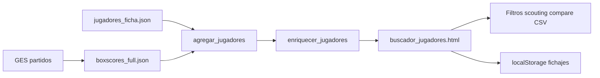

# Plan de Implementación — Scouting y Analítica Avanzada de Jugadores

**Proyecto:** Plataforma de Scouting y Fichajes — Formativas FeBAMBA (GES 2026)  
**Script principal:** `analysis/buscador_jugadores_destacados.py`  
**Módulo de métricas:** `analysis/buscador_metrics.py`

---

## 1. Estado de implementación

| Feature | Estado |
|---------|--------|
| Buscador HTML con filtros básicos | Implementado |
| 2P/3P/TL, nombre completo, edad, fichas | Implementado |
| TS%, eFG%, Val/Min, Per/p, Ast/Per | Implementado |
| Percentiles por categoría | Implementado |
| K-Means + perfiles de jugador | Implementado |
| Filtros por perfil, TS%, Val/Min | Implementado |
| Presets de scouting | Implementado |
| Lista de fichajes (localStorage) | Implementado |
| Panel de detalle + notas | Implementado |
| Comparador (máx. 3 jugadores) | Implementado |
| Exportar CSV | Implementado |
| DocumentFragment + debounce | Implementado |
| YoY multi-temporada | Pendiente (ver ARCHITECTURE.md §3.2) |
| Categorías femeninas / mini | Pendiente |

---

## 2. Arquitectura

Patrón **Pre-procesamiento offline + Frontend estático** (GitHub Pages, sin backend).



1. **Pipeline Python:** ingesta, agregación, métricas avanzadas, clustering.
2. **Dataset enriquecido:** JSON embebido en HTML.
3. **Frontend:** filtrado en memoria, scouting privado vía `localStorage`.

---

## 3. Schema del jugador (alineado con código)

```json
{
  "pid": "304655",
  "purl": "/liga-federal/jugador/97444/287745/aliberti-hilario",
  "nombre": "USUI, N.",
  "nombre_completo": "Noah Usui",
  "equipo": "Club Ejemplo",
  "cat": "U17",
  "fnac": "23/03/2013",
  "edad": 13,
  "pj": 12,
  "min_p": 24.5,
  "pts_p": 14.2,
  "reb_p": 6.8,
  "ast_p": 3.1,
  "rob_p": 1.8,
  "tap_p": 0.5,
  "val_p": 16.4,
  "per_p": 2.1,
  "t2a_p": 4.0, "t2i_p": 8.0, "t2_pct": 50.0,
  "t3a_p": 2.1, "t3i_p": 4.5, "t3_pct": 46.7,
  "tla_p": 2.0, "tli_p": 3.2, "tl_pct": 62.5,
  "ts_pct": 58.4,
  "efg_pct": 55.2,
  "val_min": 0.67,
  "ast_per": 1.48,
  "cluster_id": 2,
  "perfil": "Base Conductor",
  "pct_pts": 92,
  "pct_ts": 88,
  "pct_val": 85,
  "pct_ast": 78,
  "pct_reb": 65
}
```

- **`pid`:** ID estable para scouting y localStorage (no índice de fila).
- **Porcentajes:** escala 0–100, consistente con `t2_pct`/`t3_pct`.
- **`perfil`:** `"Muestra insuficiente"` si `pj < 5`.

---

## 4. Métricas avanzadas

| Métrica | Fórmula |
|---------|---------|
| `fga` | `t2i + t3i` |
| `fgm` | `t2a + t3a` |
| `ts_pct` | `100 × pts / (2 × (fga + 0.44 × tli))` |
| `efg_pct` | `100 × (fgm + 0.5 × t3a) / fga` |
| `val_min` | `val_p / min_p` |
| `ast_per` | `ast_p / per_p` (vacío si `per_p = 0`) |
| `pct_*` | Percentil 0–100 dentro de la misma categoría |

---

## 5. Perfiles de jugador (K-Means, k=6)

**Features:** `t3i_p`, `t3_pct`, `ast_p`, `rob_p`, `tap_p`, `reb_p` (z-score).  
Solo jugadores con `pj >= 5`.

| Perfil | Descripción |
|--------|-------------|
| Especialista 3&D | Alto volumen/acierto 3P, robos/tapones |
| Protector de Aro | Rebotes y tapones, bajo tiro exterior |
| Base Conductor | Asistencias y robos dominantes |
| Anotador de Volumen | Alto uso ofensivo, 2P y TL |
| Generador Perimetral | Equilibrio puntos/asistencias/rebotes |
| Interno de Rol | Eficiencia defensiva, bajo uso ofensivo |

**Badges (colores):**

| Perfil | Fondo | Texto |
|--------|-------|-------|
| Especialista 3&D | #EBF8FF | #2B6CB0 |
| Protector de Aro | #F0FFF4 | #2F855A |
| Base Conductor | #FAF5FF | #6B46C1 |
| Anotador de Volumen | #FFF5F5 | #C53030 |
| Generador Perimetral | #FFFAF0 | #DD6B20 |
| Interno de Rol | #EDF2F7 | #4A5568 |

---

## 6. Módulos de interfaz

### A — Filtros analítica avanzada
- Dropdown perfil (6 + Todos + Muestra insuficiente)
- Rangos TS%, Val/Min, eFG%, percentiles
- Presets: Tirador 3P, Interior reboteador, Base creador, Eficiente rotación
- Lógica AND con filtros existentes

### B — Scouting privado (localStorage)
- Clave configurable: `CLUB_SCOUTING_KEY` (default `scouting_formativas_2026`)
- Estructura: `{ "pid": { "starred": true, "note": "...", "ts": epoch } }`
- Columna estrella, toggle "Ver mi lista de fichajes", panel de detalle con notas

### C — Rendimiento
- `DocumentFragment` para render de filas
- Debounce 150 ms en inputs de búsqueda y rangos

### D — Comparador
- Hasta 3 jugadores lado a lado en panel inferior

### E — Exportación
- CSV de resultados filtrados (incluye perfil, métricas, nota de scouting)

---

## 7. Configuración del club

En `analysis/buscador_jugadores_destacados.py`:

```python
CLUB_SCOUTING_KEY = "scouting_formativas_2026"  # personalizar por club
```

---

## 8. Checklist de validación

### Fase datos
- [ ] TS% coincide con cálculo manual en jugadores de prueba
- [ ] Ningún cluster concentra > 60% de jugadores elegibles
- [ ] `pid` presente en todos los jugadores con ficha

### Fase UI
- [ ] Filtro perfil + categoría U17 combinados correctamente
- [ ] Ordenamiento en columnas TS%, Val/Min, Perfil
- [ ] Presets aplican rangos esperados

### Fase scouting
- [ ] Estrellas y notas persisten tras F5
- [ ] "Ver mi lista" filtra solo jugadores seguidos
- [ ] Comparador acepta máximo 3 jugadores

### Fase export / rendimiento
- [ ] CSV descarga con columnas completas
- [ ] Sin errores en consola del navegador
- [ ] Scroll fluido con filtros activos sobre ~12k filas

---

## 9. Comandos

```powershell
# Regenerar desde caché
.venv\Scripts\python.exe analysis/buscador_jugadores_destacados.py --desde-cache --progress

# Publicar versión cifrada
.venv\Scripts\python.exe analysis/buscador_jugadores_destacados.py --desde-cache --publicar-docs --password <pwd>
```

**Salidas:**
- Local: `outputs/buscador/buscador_jugadores.html`
- Pública: `docs/buscador_jugadores.html` → GitHub Pages
