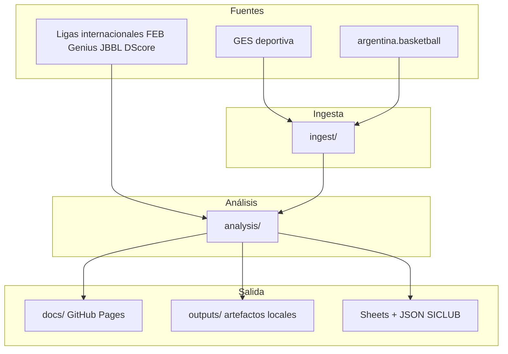

# FeBAMBA — Formativas GES

Plataforma de analítica para competencias formativas FeBAMBA. Extrae datos de **GES** y **argentina.basketball**, los procesa con pipelines Python y publica informes interactivos en **GitHub Pages**, más herramientas de scouting, standings, viajes, comparativa internacional y operaciones de club.

**Portal público:** [fblasco1.github.io/formativas_ges](https://fblasco1.github.io/formativas_ges/)  
**Repositorio:** [github.com/fblasco1/formativas_ges](https://github.com/fblasco1/formativas_ges)

---

## Qué resuelve este proyecto

FeBAMBA publica resultados en portales dispersos (GES, argentina.basketball) sin tablas unificadas ni herramientas de análisis accesibles. Este monorepo concentra:

1. **Ingesta** — scraping de fixture, actas, play-by-play y estructura de torneos.
2. **Análisis** — standings, cumplimiento reglamentario, viajes, scouting, comparativas.
3. **Publicación** — HTML estático en `docs/` servido por GitHub Pages (sin backend).
4. **Operaciones** — sync automático de fixture Pedro Echagüe → Google Sheets + JSON para **SICLUB**.

El patrón dominante es **pre-procesamiento offline + frontend estático**: Python genera JSON/HTML embebido; el navegador filtra y visualiza en memoria.



---

## Productos del portal

Hub central: [`docs/index.html`](docs/index.html)

| Producto | Descripción | Script principal | Publicado en |
|----------|-------------|------------------|--------------|
| **Standings Formativas 2026** | Tablas por etapa, nivel y zona (U9–U21) | `analysis/generar_standings_febamba_2026.py` | `docs/formativas_2026_tabla_posiciones.html` |
| **Standings Superior 2026** | Posiciones categorías superiores | `analysis/generar_standings_superior_2026.py` | `docs/superior_2026_tabla_posiciones.html` |
| **Buscador de jugadores** | Filtros avanzados, perfiles K-Means, scouting privado | `analysis/buscador_jugadores_destacados.py` | `docs/buscador_jugadores.html` |
| **Scouting de rival** | Top 3 por rubro, radar de equipo y jugador | `analysis/generar_scouting_rival.py` | `docs/scouting_rival.html` |
| **Mini Masc / cumplimiento** | Clasificación y marcadores raros U11 | `analysis/generar_informe_marcadores_raros_mini.py` | `docs/mini_masc_clasificacion.html` |
| **Propuesta Formativas 2027** | Landing: formato, fases, mapas y clubes por nivel | `analysis/generar_landing_formativas_2027.py` | `docs/propuesta_formativas_2027.html` |
| **Viajes / escenarios** | Niveles 2027 (6) + distancias | `analysis/calcular_niveles_2027.py` + `generar_informe_viajes_elite42.py` | `docs/informe_viajes_niveles.html` · `data/niveles_2027.json` |
| **Comparativa ligas U15/U16** | Brasil, España, Alemania, Serbia vs Argentina | `analysis/generar_informe_comparativo_ligas.py` | `docs/comparativa_ligas_formativas.html` |
| **Ranking / renivelación** | Power Ranking y tiras (Streamlit, local) | `apps/ranking/streamlit_app.py` | [`docs/ranking.html`](docs/ranking.html) |
| **Sync Echagüe → SICLUB** | Fixture Pedro Echagüe a Sheets + JSON | `analysis/sync_fixture_echague_sheets.py` | [`docs/sync_fixture_echague.md`](docs/sync_fixture_echague.md) |

Informes en desarrollo (código en repo, aún no en el hub del portal):

| Producto | Script | Salida actual |
|----------|--------|---------------|
| LFF / Metro objetivos | `analysis/promedios_victorias_metro_lff.py` | `outputs/lff_metro_objetivos/` |
| Informe LFF 2024 (ENEBA) | `analysis/generar_informe_febamba_lff_2024.py` | `outputs/lff/` |
| Entrenadores multiclub | `analysis/generar_informe_visual_entrenadores.py` | `outputs/entrenadores/` |
| Entrenadores → Sheets (WhatsApp) | `analysis/sync_entrenadores_sheets.py` | [`docs/entrenadores_sheets.md`](docs/entrenadores_sheets.md) |
| Ingest internacional | `analysis/descargar_stats_*.py` | exploratorio |

---

## Estructura del repositorio

```text
formativas_ges/
├── analysis/           # Pipelines de informes, buscador, sync Echagüe, LFF, viajes
├── ingest/             # Scrapers GES, argentina.basketball, parsers de boxscore/PBP
├── apps/ranking/       # Power Ranking + renivelación (Streamlit)
├── docs/               # GitHub Pages — portal público e informes HTML
├── outputs/            # Artefactos generados (cachés, JSON, HTML locales)
├── data/referencia/    # Datos estáticos (afiliadas, ENEBA 2024, etc.)
├── config/             # competencias.json, echague_sheets.json, secrets (gitignored)
├── tests/              # Tests de standings, sync Echagüe, parsers
├── .github/workflows/  # pages.yml, sync_echague_sheets.yml
├── ARCHITECTURE.md     # Modelo de datos, ingesta, SQL legacy
├── BACKLOG.md          # Roadmap y próximas features
└── Plan.md             # Plan detallado del buscador de jugadores
```

---

## Instalación y uso local

### Requisitos

- Python 3.10+
- Dependencias base: `requests`, `beautifulsoup4`, `pandas`
- Echagüe / Sheets: `gspread`, `google-auth`
- Ranking: ver `apps/ranking/requirements.txt`
- PostgreSQL opcional para pipelines legacy (`config.json`, `ges_cli.py`)

### Setup

```powershell
python -m venv .venv
.venv\Scripts\Activate
pip install requests beautifulsoup4 pandas gspread google-auth openpyxl
```

Configurar competencias en [`config/competencias.json`](config/competencias.json).

Para sync Echagüe: `config/google_service_account.json` (gitignored) o secret `GOOGLE_SERVICE_ACCOUNT_JSON` en GitHub Actions.

### Regenerar informes

Desde la raíz del repo:

```powershell
# Standings
python analysis/generar_standings_febamba_2026.py
python analysis/generar_standings_superior_2026.py

# Buscador y scouting
python analysis/buscador_jugadores_destacados.py
python analysis/generar_scouting_rival.py --desde-cache

# Viajes y comparativa
python analysis/generar_informe_viajes_elite42.py
python analysis/generar_informe_comparativo_ligas.py

# Ops Echagüe (local)
python analysis/sync_fixture_echague_sheets.py --progress
```

Varios scripts escriben directamente en `docs/`; otros generan en `outputs/` y hay que copiar el HTML a `docs/` antes de publicar.

### Ranking (Streamlit)

```powershell
pip install -r apps/ranking/requirements.txt
streamlit run apps/ranking/streamlit_app.py
```

Detalle: [`docs/ranking.md`](docs/ranking.md).

### CLI legacy

```powershell
python ges_cli.py --help
```

Ingesta argbasket, FeBAMBA y utilidades de DB. Ver [`ARCHITECTURE.md`](ARCHITECTURE.md).

---

## Automatización (GitHub Actions)

| Workflow | Trigger | Qué hace |
|----------|---------|----------|
| **Publicar informe comparativo** (`pages.yml`) | Push a `main` en `docs/**` o manual | Deploy GitHub Pages desde carpeta `docs/` |
| **Sync fixture Echagüe → Sheets** (`sync_echague_sheets.yml`) | Cron 08:00 y 20:00 ART + manual | Scrape GES → Google Sheet + `fixture_echague.json` para SICLUB |

Secret requerido: `GOOGLE_SERVICE_ACCOUNT_JSON`.

---

## Modelo de ramas

| Rama | Uso |
|------|-----|
| **`main`** | Producción: Pages, Actions, portal público |
| **`develop`** | Integración de trabajo en curso |
| **`feat/<tema>`** | Features cortas → PR a `develop` → PR a `main` |

Tags de archivo histórico: `archive/main-pre-unificacion`, `archive/Ranking_V2-2026-05`, etc.

---

## Próximas features

Roadmap detallado en [`BACKLOG.md`](BACKLOG.md). Resumen de prioridades:

| Prioridad | Feature |
|-----------|---------|
| **Alta** | Integrar al portal LFF/Metro, entrenadores y escenarios de viajes |
| **Alta** | Automatizar regeneración de standings y buscador (cron o workflow) |
| **Media** | YoY multi-temporada en buscador; categorías femeninas y mini |
| **Media** | Comparativa internacional con refresh automático (FEB, Genius, JBBL) |
| **Media** | Unificar CLI de regeneración de informes |
| **Baja** | Fotos de jugador; dashboard PostgreSQL multi-temporada |

---

## Documentación adicional

- [`ARCHITECTURE.md`](ARCHITECTURE.md) — ingesta, modelo SQL, endpoints GES/argentina.basketball
- [`BACKLOG.md`](BACKLOG.md) — completados, pendientes y roadmap
- [`Plan.md`](Plan.md) — plan de implementación del buscador de jugadores
- [`docs/sync_fixture_echague.md`](docs/sync_fixture_echague.md) — operación Echagüe / SICLUB

---

## Licencia

Uso interno FeBAMBA / análisis formativas.
